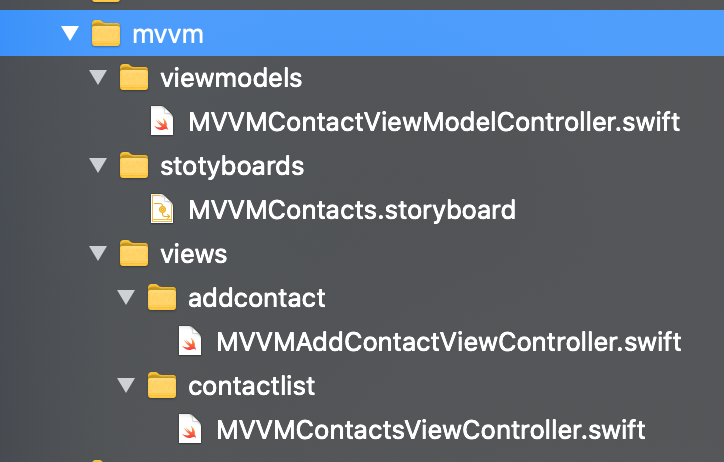
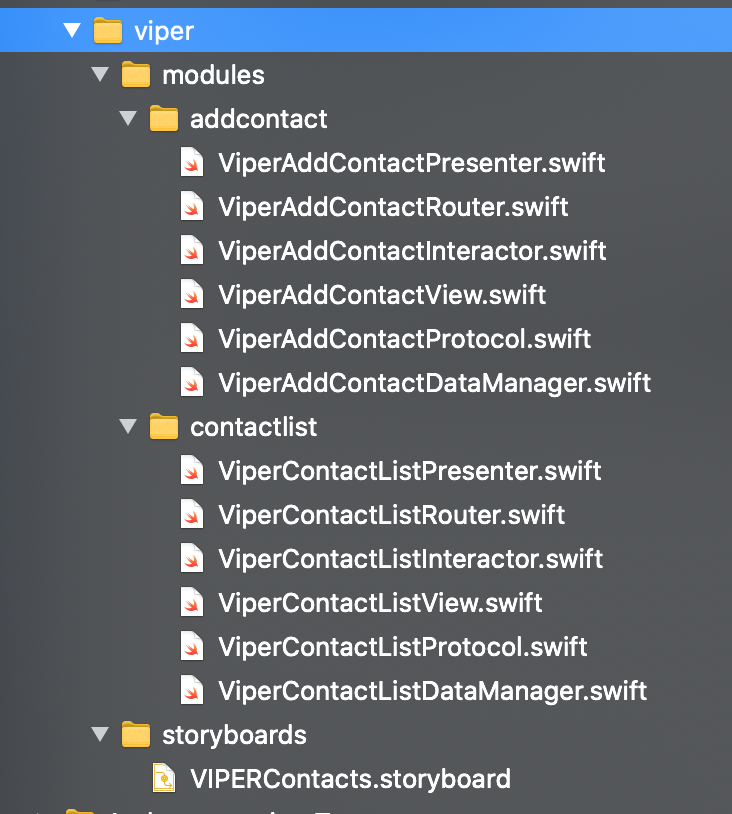
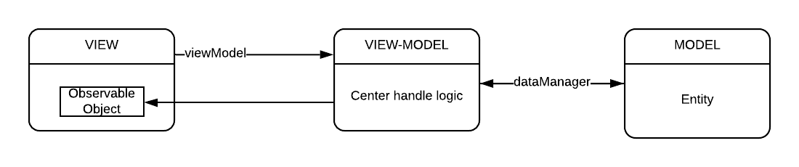

# Comparing VIPER vs MVVM
This sample used [Swift VIPER AutoGen](https://github.com/lamhoangx/iOS_SwiftViperAutoGen.git)
> The template to quickly generates skeleton files that module need to apply VIPER architecture.

# Screenshots
Both of the architecture is the same screens
<table>
    <tr>
        <td></td>
        <td></td>
        <td></td>
    </tr>
</table>

# Files structure
<table>
    <tr>
        <td>MVVM</td>
        <td>VIPER</td>
    </tr>
        <td></td>
        <td></td>
    <tr>
    </tr>
</table>

 

### Illustration VIPER

 
See more at [Swift VIPER AutoGen](https://github.com/lamhoangx/iOS_SwiftViperAutoGen.git)

### Illustration MVVM

# Summary
As you see, VIPER is very clear and independent on each a module. MVVM is an easy to reach and brief but it isn't absolutely clear on responsible yet - on logic module, it is an easy to bump.  
On the code size, MVVM produces much less code than VIPER cuz VIPER separation of concerns to easily maintain. 
So, if you are prototyping or small project, MVVM can take care of, quickly deploy and still be easy maintain. And you are a long-term project, VIPER is a good deal.

# References
The sample ref [Comparing MVVM and Viper architectures](https://auth0.com/blog/compare-mvvm-and-viper-architectures/) article.

#
...